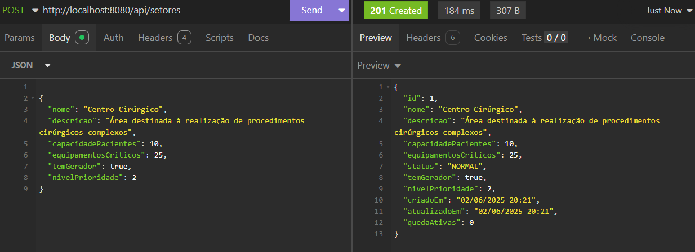
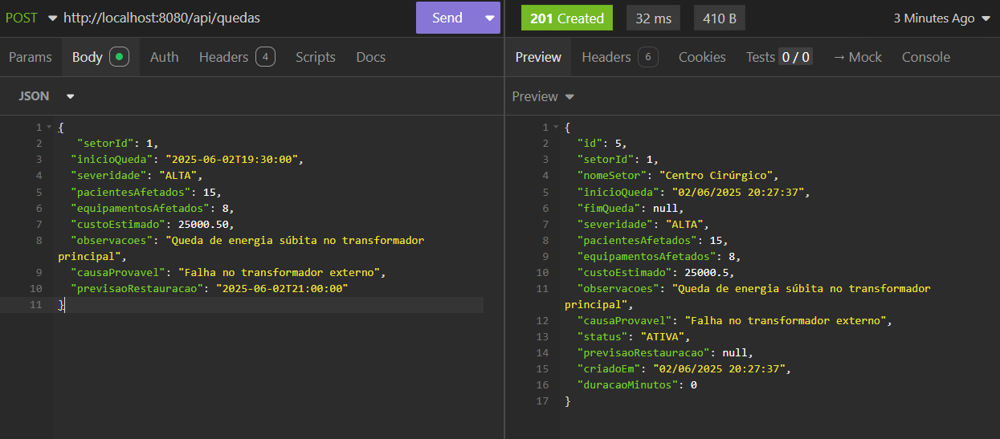
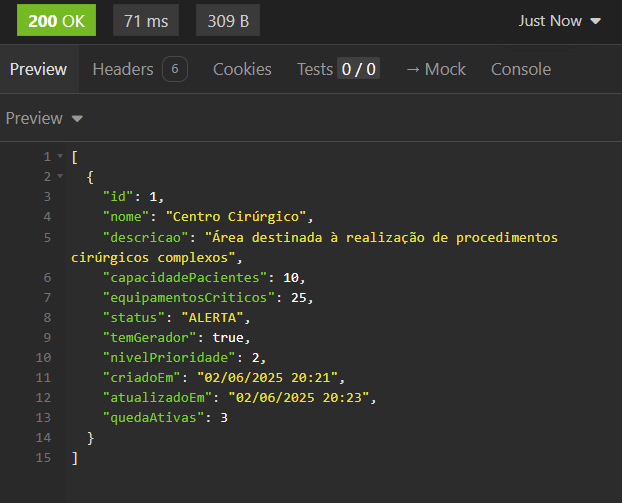

## 👥 Integrantes do Grupo

| Nome                     | RM     |
| ------------------------ | ------ |
| Kaiky Alvaro Miranda     | 98118  |
| Lucas Rodrigues da Silva | 98344  |
| Juan Pinheiro de França  | 552202 |


# PowerGuardian - Hospital Energia API

Sistema de monitoramento de energia para ambientes hospitalares desenvolvido com Spring Boot.

## 📋 Sobre o Projeto

Esta API fornece funcionalidades para monitorar quedas de energia em setores hospitalares, permitindo:
- Cadastro e gerenciamento de setores
- Registro e acompanhamento de quedas de energia
- Dashboard com visão geral do sistema
- Análise de impacto das quedas
- Relatórios e métricas

## 🚀 Tecnologias Utilizadas

- **Java 17**
- **Spring Boot 3.2.0**
- **Spring Data JPA**
- **H2 Database**
- **SpringDoc OpenAPI** (Swagger)
- **Lombok**
- **Maven**

## 📁 Estrutura do Projeto

```
src/
├── main/
│   ├── java/com/powerguardian/gs/
│   │   ├── PowerguardianJavaApplication.java
│   │   ├── config/
│   │   │   └── SwaggerConfig.java
│   │   ├── controller/
│   │   │   ├── DashboardController.java
│   │   │   ├── SetorController.java
│   │   │   └── QuedaEnergiaController.java
│   │   ├── service/
│   │   │   ├── DashboardService.java
│   │   │   ├── SetorService.java
│   │   │   └── QuedaEnergiaService.java
│   │   ├── repository/
│   │   │   ├── SetorRepository.java
│   │   │   └── QuedaEnergiaRepository.java
│   │   ├── model/
│   │   │   ├── Setor.java
│   │   │   ├── QuedaEnergia.java
│   │   │   └── StatusHospital.java
│   │   └── dto/
│   │       ├── DashboardResponseDTO.java
│   │       ├── SetorDTO.java
│   │       ├── QuedaEnergiaDTO.java
│   │       └── ImpactoDTO.java
│   └── resources/
│       ├── application.yml
```

## 🔧 Instalação e Execução

### Pré-requisitos
- Java 17+
- Maven 3.6+

### Executando o Projeto

**Clone o repositório:**
```bash
git clone [seu-repositorio]
cd powerguardian-java
```

**Execute com Maven:**
```bash
mvn spring-boot:run
```


## 📖 Documentação da API

Após iniciar a aplicação, acesse:

- **Swagger UI:** http://localhost:8080/swagger-ui.html
- **API Docs:** http://localhost:8080/v3/api-docs

### Credenciais H2 (desenvolvimento):
- **URL:** jdbc:h2:mem:powerguardian
- **User:** sa
- **Password:** (vazio)

## 🛠 Endpoints Principais

### Dashboard
- `GET /api/dashboard` - Dados consolidados do dashboard
- `GET /api/dashboard/status` - Status geral do sistema

### Setores
- `GET /api/setores` - Listar todos os setores
- `GET /api/setores/prioridade` - Setores por prioridade
- `GET /api/setores/afetados` - Setores com quedas ativas
- `GET /api/setores/{id}` - Buscar setor específico
- `POST /api/setores` - Criar novo setor
- `PUT /api/setores/{id}` - Atualizar setor
- `DELETE /api/setores/{id}` - Deletar setor

### Quedas de Energia
- `GET /api/quedas` - Listar todas as quedas
- `GET /api/quedas/ativas` - Quedas não resolvidas
- `GET /api/quedas/setor/{setorId}` - Quedas por setor
- `GET /api/quedas/impacto` - Impacto total das quedas
- `POST /api/quedas` - Registrar uma nova queda
- `PUT /api/quedas/{id}/resolver` - Marcar uma queda como resolvida.

## Imagens de exemplo dos endpoints

### Criando novo setor
- `POST /api/setores` - Criar novo setor

```
json
{
  "nome": "Centro Cirúrgico",
  "descricao": "Área destinada à realização de procedimentos cirúrgicos complexos",
  "capacidadePacientes": 10,
  "equipamentosCriticos": 25,
  "temGerador": true,
  "nivelPrioridade": 2
}
```


### Criando nova queda de energia
- `POST /api/quedas` - Registrar uma nova queda 
```
json
{
  "setorId": 1,
  "inicioQueda": "2025-06-02T19:30:00",
  "severidade": "ALTA",
  "pacientesAfetados": 15,
  "equipamentosAfetados": 8,
  "custoEstimado": 25000.50,
  "observacoes": "Queda de energia súbita no transformador principal",
  "causaProvavel": "Falha no transformador externo",
  "previsaoRestauracao": "2025-06-02T21:00:00"
}
```


### Visualizando dados no dash
- `GET /api/dashboard` - Dados consolidados do dashboard
